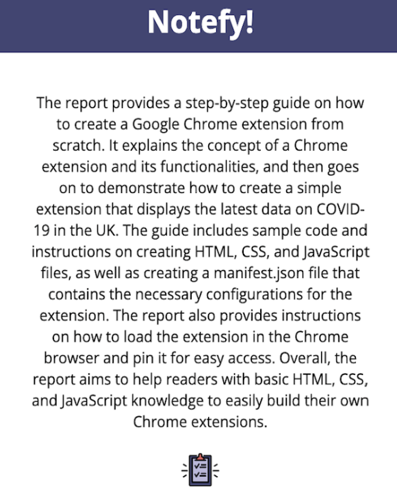

# Notefy!

#### A Chrome extension which gives a short summary of the content on any webpage! 


## About this Project
### Built With
- [![JavaScript][JavaScript_Logo]][JavaScript-url]
- [![HTML][HTML_Logo]][HTML-url]
- [![CSS][CSS_Logo]][CSS-url]
- [![Chrome][Chrome_Logo]][Chrome-url]
  
### Description/Motivation
Notefy is a Chrome Extension built with Manifest v3. It is available on the [Chrome Web Store](https://chromewebstore.google.com/detail/notefy/hdcafibdomecmmbfjnbkncbpioepcgaa). Notefy uses OpenAI's Chat Completions API to summarize the text on any webpage within seconds. The motivation behind this extension was for users who didn't want to spend time reading a full news article or blog and just wanted a quick summary. 

### How to Use
Navigate to any website of your choosing and then just click on the Notefy extension. It will open up a small pop-up and in a few seconds, it will display a summary of the text!
<video src="notefy-demo-vid.mov" autoPlay loop style={{ width: '100%', maxHeight: '500px' }} />


<!-- ROADMAP -->
## Roadmap
- [X] Pulled text from a webpage and used Open AI Chat Completions API to generate a summary
- [X] Created pop-up for the extension that when clicked will generate summary and display it
- [ ] Make UI more visually aesthetic
- [ ] Add feature that when logo is clicked that the summary will be copied to clipboard
- [ ] Add Q&A feature
  - [ ] User can ask input questions about the article
  - [ ] Use Chat Completions API to answer question and display answer on pop-up
- [ ] Add history feature so history of summaries requested will be saved somewhere

## Contributing
### Installation
1. Create an Open AI API Key at [https://platform.openai.com/api-keys](https://platform.openai.com/api-keys)
2. Clone the repo
   ```sh
   git clone https://github.com/risharma101/RishGPT
   ```
3. Create a `.env` file in the main project folder and enter your API Key in it
   ```js
   const API_KEY = 'ENTER YOUR API';
   ```
### Guidelines
Contributions are what make the open source community such an amazing place to learn, inspire, and create. Any contributions you make are **greatly appreciated**.

If you have a suggestion that would make this better, please fork the repo and create a pull request. You can also simply open an issue with the tag "enhancement".
Don't forget to give the project a star! Thanks again!

1. Fork the Project
2. Create your Feature Branch (`git checkout -b feature/AmazingFeature`)
3. Commit your Changes (`git commit -m 'Add some AmazingFeature'`)
4. Push to the Branch (`git push origin feature/AmazingFeature`)
5. Open a Pull Request
   


<!-- LICENSE -->
## License
Distributed under the MIT License. See `LICENSE.txt` for more information.

<!-- CONTACT -->
## Contact

Rishabh Sharma - rishabhsharma@ucla.edu

Project Link: [https://github.com/risharma101/Notefy](https://github.com/risharma101/Notefy)


<!-- ACKNOWLEDGMENTS -->
## Acknowledgments
* [Chrome Extension Docs](https://developer.chrome.com/docs/extensions/get-started)
* [README Template](https://github.com/othneildrew/Best-README-Template)
   
[JavaScript_Logo]: https://img.shields.io/badge/JavaScript-F7DF1E.svg?style=for-the-badge&logo=JavaScript&logoColor=black
[HTML_Logo]: https://img.shields.io/badge/HTML5-E34F26.svg?style=for-the-badge&logo=HTML5&logoColor=white
[CSS_Logo]: https://img.shields.io/badge/CSS3-1572B6.svg?style=for-the-badge&logo=CSS3&logoColor=white
[Chrome_Logo]: https://img.shields.io/badge/Google%20Chrome-4285F4.svg?style=for-the-badge&logo=Google-Chrome&logoColor=white
[JavaScript-url]: https://developer.mozilla.org/en-US/docs/Web/JavaScript
[HTML-url]: https://developer.mozilla.org/en-US/docs/Web/HTML
[CSS-url]: https://developer.mozilla.org/en-US/docs/Web/CSS
[Chrome-url]: https://developer.chrome.com/docs/extensions/get-started
